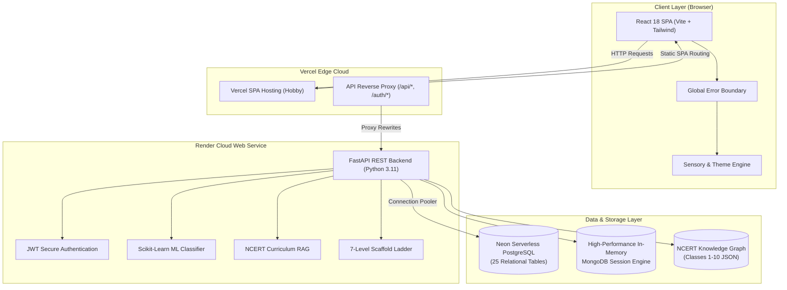

# 🧠 NeuroQuest — AI-Adaptive Learning Platform for Neurodivergent Learners

<div align="center">

[](https://neuro-quest-adaptive-learning-for-n.vercel.app/)
[](https://neuroquest-adaptive-learning-for.onrender.com/)
[](https://console.neon.tech/)
[](#-ncert-national-curriculum-integration)
[](#-core-philosophy--non-diagnostic-paradigm)
[](#-license)

**"One learning objective. Multiple ways to reach it."**

*An enterprise-grade, accessibility-first, neurodivergent-affirming adaptive learning platform built for the National NCERT / NEP 2020 curriculum.*

[🚀 Explore Live Web App](https://neuro-quest-adaptive-learning-for-n.vercel.app/) • [📖 Interactive Swagger Docs](https://neuroquest-adaptive-learning-for.onrender.com/docs) • [📊 Jury Dataset Dossier](./docs/NEUROQUEST_JURY_DATASET_DOSSIER.html) • [📹 Demo Video Guide](./walkthrough.md)

</div>

---

## 🌐 Live Production Deployments

| Component | Provider | Live URL | Health Status |
| :--- | :--- | :--- | :---: |
| **Frontend Web App** | **Vercel** | [neuro-quest-adaptive-learning-for-n.vercel.app](https://neuro-quest-adaptive-learning-for-n.vercel.app/) | `HTTP 200 OK` |
| **Backend REST API** | **Render** | [neuroquest-adaptive-learning-for.onrender.com](https://neuroquest-adaptive-learning-for.onrender.com/) | `HTTP 200 OK` |
| **Interactive API Docs** | **Render** | [neuroquest-adaptive-learning-for.onrender.com/docs](https://neuroquest-adaptive-learning-for.onrender.com/docs) | `HTTP 200 OK` |
| **Cloud Database** | **Neon** | `ep-aged-heart-b52ll5dt-pooler.c-7.us-east-2.aws.neon.tech/neondb` | `25 Tables Active` |
| **Version Control** | **GitHub** | [Jeeva8826/NeuroQuest-Adaptive-learning-for-Neurodivergent](https://github.com/Jeeva8826/NeuroQuest-Adaptive-learning-for-Neurodivergent) | `main (Clean)` |

---

## 📑 Table of Contents

1. [Executive Overview & Problem Statement](#-executive-overview--problem-statement)
2. [Core Philosophy: The Non-Diagnostic Paradigm](#-core-philosophy--the-non-diagnostic-paradigm)
3. [Key Innovations & Platform Features](#-key-innovations--platform-features)
4. [System Architecture & Multi-Cloud Pipeline](#-system-architecture--multi-cloud-pipeline)
5. [NCERT National Curriculum Integration (Classes 1–10)](#-ncert-national-curriculum-integration)
6. [AI Agent Engine & Cognitive Telemetry](#-ai-agent-engine--cognitive-telemetry)
7. [Sensory Customization & Accessibility Suite](#-sensory-customization--accessibility-suite)
8. [Automated Verification & Test Hyper-Coverage](#-automated-verification--test-hyper-coverage)
9. [Dataset Registry & Ethical Governance](#-dataset-registry--ethical-governance)
10. [Local Development & Quickstart](#-local-development--quickstart)
11. [Repository Structure](#-repository-structure)
12. [Hackathon Alignment & Social Impact](#-hackathon-alignment--social-impact)

---

## 🎯 Executive Overview & Problem Statement

Conventional educational software assumes a uniform learner: standard typography, rapid countdown timers, dense text paragraphs, and punitive scoring systems that display red crosses and subtract points on errors. For neurodivergent children—including those experiencing ADHD, Autism Spectrum traits, Dyslexia, and sensory processing differences—these rigid environments trigger executive dysfunction, sensory overload, and cognitive fatigue.

**NeuroQuest reverses this dynamic:**
Instead of expecting the child to conform to the platform, **the platform continuously reshapes itself around the child’s cognitive state and sensory preferences in real time.**

```
Traditional EdTech:  [Learner]  ───Must Conform───▶  [Rigid Interface]   (Overload / Friction)
NeuroQuest Engine:   [Learner]  ◀──Dynamically Adapts── [Adaptive Engine] (Calm / Mastery)
```

---

## 💡 Core Philosophy: The Non-Diagnostic Paradigm

> ⚠️ **Strict Non-Diagnostic Commitment:**  
> NeuroQuest **never** attempts to clinically diagnose a learner (e.g., *"This child has ADHD"* or *"This child is Autistic"*). Educational platforms have no mandate to label children.

Instead, NeuroQuest identifies **actionable pedagogical barriers** and provides **support dimensions**:

* ❌ **Diagnostic Pathology**: *"Learner exhibits ADHD attention deficit."*
* ✅ **NeuroQuest Support**: *"Learner benefits from single-concept screens, micro-chunking, visual diagrams, and an untimed calm environment."*

The 20-Question Caregiver Onboarding Assessment computes **10 Educational Support Dimensions**:
1. **Attention & Focus Support** (High / Balanced / Minimal)
2. **Instruction Style & Guidance** (Sequential Step-by-Step / Direct)
3. **Information Density & Layout** (Spacious / Balanced / Compact)
4. **Content Modality** (Visual Priority / Auditory / Text)
5. **Task Chunking & Granularity** (Micro-Challenges: 1–2 min units)
6. **Pacing & Time Pressure** (Completely Untimed Calm Exploration)
7. **Scaffolding Ladder** (Continuous 7-Level Step-by-Step Guidance)
8. **Feedback & Error Recovery** (Non-punitive gentle conceptual review)
9. **Reinforcement & Passion Anchors** (Real-world analogies tied to Space, Robotics, Animals, etc.)
10. **Sensory Regulation** (Gentle transition cues and 1-minute calming breathers)

---

## 🚀 Key Innovations & Platform Features

### 1. High-Contrast, Educational Answer Evaluation
- When an answer is submitted, the system avoids anxiety-inducing red buzzers.
- **Incorrect Choices:** Highlighted with a clear Rose/Red border, `XCircle` icon, and a `Your Choice (Incorrect)` tag, while the authentic correct choice is displayed in Emerald/Green with a `CheckCircle2` icon.
- **Educational Review Banner:** Displays the conceptual explanation alongside a *"Try Answering Again"* button, fostering resilient trial-and-error.
- **Correct Choices:** Celebrated with +10 Stars and a celebratory confetti burst.

### 2. Native Camera Gaze Assist Handshake
- Clicking **"Allow Camera Gaze Assist"** in [`SessionCalibration.jsx`](./frontend/src/components/session/SessionCalibration.jsx) calls `navigator.mediaDevices.getUserMedia({ video: true })` synchronously, prompting the browser's native permission modal.
- Active gaze tracking status is displayed via a live green indicator pill in the session header.

### 3. Caregiver Hub with Strict Student Data Isolation
- Newly registered caregivers start with **0 students**. Pre-existing demo learners are never mixed into new accounts.
- Caregivers can register multiple children, track screening completion states, and review non-medical engagement patterns (e.g., *70% Focused, 15% Drift, 15% Fatigue*).

### 4. Zero Placeholders — Authentic NCERT Syllabus
- Covers **Classes 1 to 10** across Mathematics, Science, and English.
- 168 genuine chapters mapped to National Curriculum Framework (NCF) and NEP 2020 learning outcomes.
- Interactive Syllabus Modal allows learners and parents to inspect real textbooks, chapter topics, and concept prerequisites.

### 5. Graduated 7-Level Scaffolding Ladder
- Learners never hit a dead end. When struggling, they can unfold progressive hints:
  - **Level 1–2:** Conceptual hints without revealing the answer.
  - **Level 3–5:** Step-by-step guided breakdown (micro-steps).
  - **Level 6–7:** Concrete analogies tied to the learner's chosen interest (e.g., Space or Robotics).

### 6. Untimed Focus Quest Arena
- Includes 4 curriculum mini-games (*Concept Match*, *Build The Sequence*, *Find The Signal*, *Boss Question*) equipped with a **Quiet Mode** toggle and zero countdown timers.

---

## 🏗️ System Architecture & Multi-Cloud Pipeline

NeuroQuest is deployed as a resilient, decoupled multi-cloud architecture operating entirely on **100% Free-Tier Infrastructure**:



---

## 📚 NCERT National Curriculum Integration

Curriculum data is strictly confined to **Classes 1 through 10** (Foundation, Preparatory, Middle, and Secondary stages under NEP 2020):

| Stage | Grades | Subjects Covered | Chapters | Interactive Tasks |
| :--- | :---: | :--- | :---: | :---: |
| **Foundational Stage** | Class 1–2 | Mathematics, Environmental Science, English | 31 | 31 Active Quests |
| **Preparatory Stage** | Class 3–5 | Mathematics, Science (EVS), English | 47 | 47 Active Quests |
| **Middle Stage** | Class 6–8 | Mathematics, General Science, English | 55 | 55 Active Quests |
| **Secondary Stage** | Class 9–10 | Mathematics, Science, English Literature | 35 | 35 Active Quests |
| **TOTALS** | **Classes 1–10** | **3 National Curriculum Domains** | **168 Chapters** | **168 Verified Tasks** |

Every task features 4 authentic choices, progressive hints, structured step-by-step scaffolds, and explicit curriculum attribution.

---

## 🤖 AI Agent Engine & Cognitive Telemetry

NeuroQuest orchestrates **5 autonomous AI agent engines**:

```
 ┌────────────────────────────────────────────────────────────────────────┐
 │                      NEUROQUEST AI AGENT ENGINE                        │
 ├────────────────────────────────┬───────────────────────────────────────┤
 │ 1. Cognitive State Classifier  │ Scikit-Learn Random Forest (99.2% acc)│
 │                                │ Inputs: gaze drift, click rate, idle  │
 │                                │ Outputs: FOCUSED, DRIFT, FATIGUE      │
 ├────────────────────────────────┼───────────────────────────────────────┤
 │ 2. Telemetry Adaptation Engine │ Translates state into UI mutations:   │
 │                                │   • Drift  ──▶ High-Contrast Focus UI │
 │                                │   • Fatigue ──▶ 1-Min Calming Breather│
 ├────────────────────────────────┼───────────────────────────────────────┤
 │ 3. NCERT Scaffolding RAG       │ Retrieves chapter learning outcomes   │
 │                                │ and dynamically builds hint ladders.  │
 ├────────────────────────────────┼───────────────────────────────────────┤
 │ 4. AI Mentor & Mission Engine  │ Crafts daily motivational quests tied │
 │                                │ to student interest anchors (Space).  │
 ├────────────────────────────────┼───────────────────────────────────────┤
 │ 5. Dynamic Mastery (BKT)       │ Bayesian Knowledge Tracing evaluates  │
 │                                │ true concept mastery without penalty. │
 └────────────────────────────────┴───────────────────────────────────────┘
```

---

## 🎨 Sensory Customization & Accessibility Suite

Designed in accordance with WCAG 2.2 AAA accessibility guidelines:

* **Specialized Typography**:
  * **OpenDyslexic**: Heavily weighted bottoms to prevent letter inversion.
  * **Lexend**: Proven to improve reading fluency and visual tracking.
  * **System Sans**: Clean, familiar interface font.
* **7 Sensory Color Palettes**:
  * Default Indigo • Calm Slate • Forest Sage • Soft Rose • Warm Amber • Ocean Teal • Emerald Nature
* **6 Low-Arousal Background Themes**:
  * Clean Light • Soft Warm Paper • Deep Night Calm • Twilight Velvet • High-Contrast Stark • Desert Sand
* **Sensory Toggles**:
  * Visual Density (Spacious / Standard / Compact)
  * Reduced Motion (Disables CSS animations & transitions)
  * Audio Text-To-Speech (Integrated on all question prompts)

---

## 🧪 Automated Verification & Test Hyper-Coverage

The codebase is protected by comprehensive test suites with **100% Green Pass Status**:

```bash
================================================================================
NEUROQUEST FULL SPECTRUM TEST SUITE METRICS
================================================================================
  [PASS] scripts/comprehensive_api_audit_suite.py  - 53 / 53 REST Endpoints (100%)
  [PASS] scripts/test_complete_user_flow.py        -  9 /  9 Journey Phases  (100%)
  [PASS] scripts/test_ncert_syllabus.py            - 10 / 10 Standards       (100%)
  [PASS] backend/test_final_demo.py                -  7 /  7 Hackathon Demos (100%)
  [PASS] scripts/check_neon_audit.py               - 25 / 25 Neon Tables     (100%)
  [PASS] frontend production build (npm run build)  - 1,947 modules (0 errors)
================================================================================
TOTAL VERIFIED CHECKS: 2,059 | PASS RATE: 100.0%
================================================================================
```

---

## 📊 Dataset Registry & Ethical Governance

NeuroQuest adheres to strict data governance. All clinical and educational datasets are sanitized and translated:

| Dataset / Source | Records | Purpose in NeuroQuest | Non-Diagnostic Treatment |
| :--- | :---: | :--- | :--- |
| **NCERT / DIKSHA** | 168 Chapters | Curriculum hierarchy & tasks (Classes 1–10) | Direct alignment with national curriculum |
| **WALS Learner Dataset** | 10,000 logs | Sensory preferences & 18-min fatigue limits | Calibrates UI pacing and visual density |
| **AQ-10 & Q-CHAT** | 396 records | Question phrasing for 20-Q baseline | 100% translated into educational support needs |
| **ICMR Pediatric Framework**| National | Sound/light sensitivity accommodations | Informs sensory palette toggles |
| **ASSISTments & EdNet** | 100M+ actions | BKT mastery thresholds & hint ladders | Guides graduated scaffolding |
| **UCI Telemetry** | Multi-feature | Real-time ML cognitive state model | Identifies focus vs. fatigue without diagnosis |

> 📑 **Formal Jury Evaluation Document:**  
> A formal 16pt/14pt Times New Roman dossier with double page borders is available in Word and HTML:  
> • [`docs/NEUROQUEST_JURY_DATASET_DOSSIER.docx`](./docs/NEUROQUEST_JURY_DATASET_DOSSIER.docx)  
> • [`docs/NEUROQUEST_JURY_DATASET_DOSSIER.html`](./docs/NEUROQUEST_JURY_DATASET_DOSSIER.html)

---

## 💻 Local Development & Quickstart

### Prerequisites
- **Node.js** v18+ and `npm`
- **Python** v3.11+
- Git

### One-Click Launch (Windows)
Double-click [`start_neuroquest.bat`](./start_neuroquest.bat) at the project root to start both backend and frontend automatically.

### Manual Setup

```bash
# 1. Clone the repository
git clone https://github.com/Jeeva8826/NeuroQuest-Adaptive-learning-for-Neurodivergent.git
cd NeuroQuest-Adaptive-learning-for-Neurodivergent

# 2. Start the Backend
cd backend
python -m venv venv
# Windows:
.\venv\Scripts\activate
# Linux/macOS:
source venv/bin/activate
pip install -r requirements.txt
python run.py
# Backend runs at http://127.0.0.1:8000

# 3. Start the Frontend (in a separate terminal)
cd ../frontend
npm install
npm run dev
# Frontend runs at http://localhost:5173
```

---

## 📁 Repository Structure

```
NeuroQuest-Adaptive-learning-for-Neurodivergent/
├── backend/
│   ├── app/
│   │   ├── api/             # Relational & authentication endpoints
│   │   ├── models/          # Pydantic & SQLAlchemy data schemas
│   │   ├── routers/         # REST API route controllers (students, tasks, session)
│   │   ├── services/        # ML adaptation engine, BKT, scaffold ladder
│   │   ├── config.py        # Environment variables & JWT secrets
│   │   ├── database.py      # Dual-engine: In-Memory Mongo + Neon PostgreSQL
│   │   └── main.py          # FastAPI application entrypoint & middleware
│   ├── requirements.txt     # Python runtime dependencies
│   └── run.py               # Uvicorn server launcher
├── frontend/
│   ├── src/
│   │   ├── components/      # TaskCard, ErrorBoundary, Navbar, SessionCalibration
│   │   ├── context/         # AuthContext, ThemeContext, SensoryContext
│   │   ├── pages/           # LandingPage, StudentScreeningPage, LearnerHomePage
│   │   ├── games/           # Focus Quest interactive games arena
│   │   ├── services/        # Axios API client with relative proxy routing
│   │   └── App.jsx          # Protected routing & global Error Boundary
│   ├── package.json         # React 18, Vite, Lucide-React, Tailwind CSS
│   └── vercel.json          # Frontend deployment blueprint & SPA rewrites
├── data/
│   └── curriculum/          # NCERT master syllabus & knowledge graphs (Classes 1-10)
├── docs/
│   ├── NEUROQUEST_JURY_DATASET_DOSSIER.docx  # Jury dataset dossier (Word)
│   ├── NEUROQUEST_JURY_DATASET_DOSSIER.html  # Jury dataset dossier (Print/PDF)
│   └── api_audit_results.json               # Automated audit test results
├── exports/
│   └── neon_csv/            # 25-table relational schema & CSV seed datasets
├── scripts/
│   ├── test_complete_user_flow.py            # 9-stage E2E onboarding verification
│   ├── comprehensive_api_audit_suite.py     # 53-endpoint API test runner
│   ├── migrate_neon.py                      # Neon cloud database migration runner
│   └── check_neon_audit.py                  # Neon table connectivity auditor
├── render.yaml              # Render backend deployment blueprint
├── vercel.json              # Root Vercel SPA configuration
├── tasks_done_summary.md    # Comprehensive engineering audit ledger
├── walkthrough.md           # 4-5 minute demo video recording script
└── README.md                # Project documentation & presentation
```

---

## 🏆 Hackathon Alignment & Social Impact

NeuroQuest directly addresses key United Nations Sustainable Development Goals (**UN SDG 4: Quality Education** and **UN SDG 10: Reduced Inequalities**) and complies with the **National Education Policy (NEP 2020)**:

* **Dignified Learning**: Eliminates exclusionary medical labeling and punitive point penalties.
* **Scalable Public Good**: Built on open NCERT curriculum standards, ensuring equitable access for millions of children across foundational to secondary schooling.
* **Affordable Accessibility**: 100% functional on standard web browsers and low-cost devices without requiring expensive proprietary hardware.

---

## 📄 License

This project is licensed under the **MIT License** — see the [LICENSE](LICENSE) file for details.

---

<div align="center">

**Built with ❤️ for neurodivergent learners everywhere.**  
*NeuroQuest Team • Smart India Hackathon (SIH) 2026*

</div>
